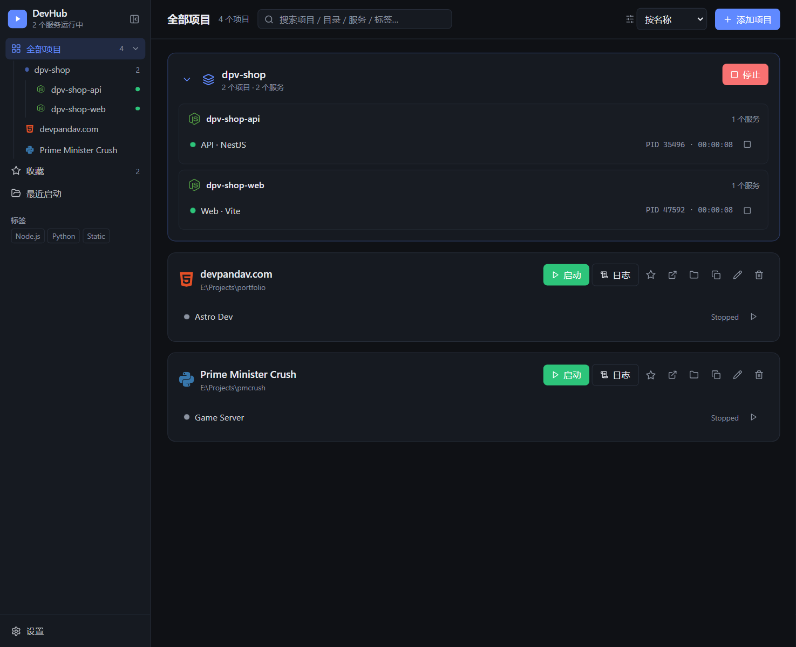
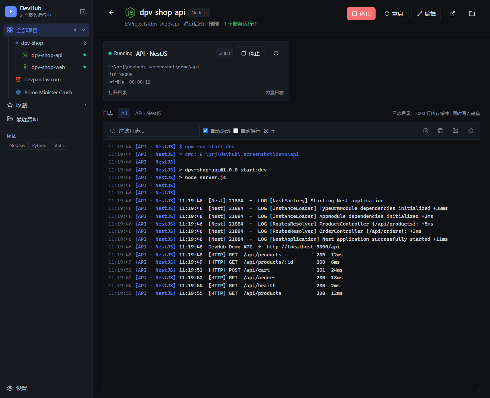
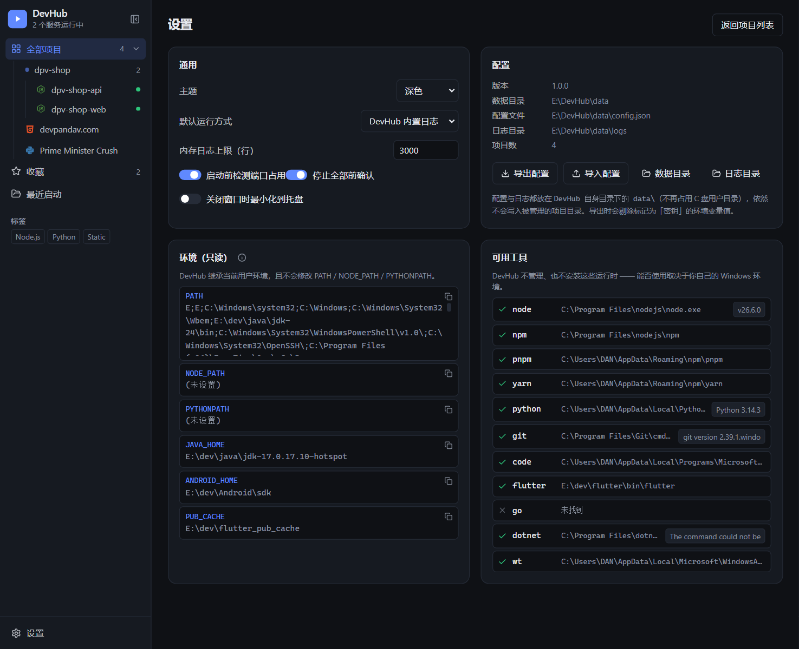

# DevHub — Windows 本地开发项目启动器

**简体中文** | [English](README.en.md)

> 一个极其轻量的 Windows 本地开发项目启动器：**记住你的项目怎么启动**，然后一键启停。
>
> DevHub 不管理环境（不装 Node/Python、不改 PATH），只管理「在哪个目录执行什么命令」。



_（截图使用演示数据：同属 `dpv-shop` 分组的前后端被合并成一张分组卡片，一键启停）_

## 界面

**项目详情 / 实时日志**：服务状态、端口、PID、运行时长，以及 `npm run dev` 的实时输出（stdout/stderr 分色，可过滤、可选中复制、自动滚动）。



**设置**：运行方式、端口检测、日志上限、托盘，以及只读的环境与可用工具清单。配置与日志都放在 DevHub 自己的 `data/` 目录里。



## 怎么运行（3 步）

> 前置：Windows 10/11 + Node.js 18 以上（只是开发 DevHub 本身需要；被管理的项目的环境仍由你自己负责）

在 `E:\prj\devhub` 目录下打开终端，依次执行：

```bash
npm install     # 只做一次：安装依赖（node_modules 已在本机装好，可跳过）
npm run build   # 构建（改了代码后需要重新执行）
npm start       # 启动 DevHub 窗口
```

- **日常开发**用 `npm run dev`：改前端代码即时热更新，改主进程代码自动重启。
- **日常使用**用 `npm start`：直接跑已构建的版本，启动更快。
- 其它脚本：`npm run typecheck`（TS 类型检查）、`npm run build`（等价于 `electron-vite build`）。
- 想不敲命令：在 `E:\prj\devhub` 里建一个 `DevHub.bat`，内容写
  `npm start`，双击即可（后续可再打包成 exe / 安装到开始菜单）。

### 在另一台机器安装 / `npm install` 卡住

**原因**：Electron 的二进制（约 100MB）默认从 GitHub 下载，国内网络经常卡死或超时，
表现就是停在 `boolean@3.2.0 deprecated` 之类的警告后面半天不动。

**方法 A（推荐）**：拷贝过去的项目里已带 `.npmrc` 和 `install.bat`，双击 **`install.bat`**
即可（同时强制走国内镜像）。若要手写 `.npmrc`，内容如下：

```ini
registry=https://registry.npmmirror.com
electron_mirror=https://npmmirror.com/mirrors/electron/
electron_builder_binaries_mirror=https://npmmirror.com/mirrors/electron-builder-binaries/
fetch-retries=5
fetch-timeout=120000
```

**方法 B（临时，不写文件）**：在 CMD 里先设环境变量再装：

```bat
set ELECTRON_MIRROR=https://npmmirror.com/mirrors/electron/
npm i --registry=https://registry.npmmirror.com
```

PowerShell 用 `$env:ELECTRON_MIRROR="https://npmmirror.com/mirrors/electron/"`。

**如果已经卡住/中断过一次**，先清掉残缺缓存再重装，否则会一直失败：

```bat
Ctrl + C                                        :: 先中断
rd /s /q %LOCALAPPDATA%\electron\Cache           :: 删掉残缺的 electron 下载缓存
rd /s /q E:\prj\devhub\node_modules              :: 删掉半成品依赖
npm cache clean --force
npm i
```

装完后验证：`npx electron -v` 能输出版本号即说明二进制下载成功。

### 常见问题

- **`npm install` 一直卡住不动**：见上一节「在另一台机器安装」。
- **报 `Cannot read properties of undefined (reading 'getPath')`**：
  你的终端设置了 `ELECTRON_RUN_AS_NODE=1`（常见于嵌套在 Electron 应用内的终端），
  electron 会退化成普通 Node。`npm run dev` / `npm start` 走的是 `scripts/start.mjs`，
  它会自动清掉该变量；直接运行 electron 时请手动
  `set ELECTRON_RUN_AS_NODE=` 或 `env -u ELECTRON_RUN_AS_NODE electron .`。
- **GPU 进程崩溃 / 窗口一闪而过 / `GPU process isn't usable. Goodbye.`**：
  在远程会话、服务、无显卡或受限沙箱环境里会出现，禁掉 GPU 即可：
  `electron . --disable-gpu --no-sandbox`。
- **npm 命令找不到**：先确认 `node -v`、`npm -v` 能正常输出，DevHub 不会替你安装 Node。

### 首次使用

1. 点右上角 **+ 添加项目** → 选择你的代码根目录（例如 `E:\Projects`）
2. 点「扫描」→ 勾选识别出的项目 → DevHub 自动生成 `npm run dev` 之类的命令
   - 如果选中的是**包含多个子项目的父目录**（典型的前后端分离仓库），
     会自动以父目录名预填「分组名称」，确认后这些子项目就是**一个分组**
3. 回到列表，点项目卡片或分组卡片上的 **▶ 启动**；点进项目卡片可看实时日志

> 已经添加过的项目想合并成组：分别编辑它们，在「分组」里填**同一个名字**保存即可。

### 自检脚本

```bash
node scripts/smoke-test.mjs   # 不启动界面，直接验证：启动命令 / 实时日志 / 杀进程树 / 环境不变
```

## 功能总览

### 项目管理

- 添加 / 编辑 / 删除 / 复制项目；一个项目可含多个 **Service**（名称、工作目录、启动命令、端口、环境变量）
- **目录扫描**：识别 package.json / requirements.txt / pyproject.toml / pubspec.yaml /
  go.mod / Cargo.toml / *.csproj / pom.xml / composer.json / index.html，
  并自动发现 npm scripts（dev / start:dev / start…），点击即生成启动命令
- **技术栈图标**：按项目类型显示对应品牌图标（Node.js / Python / Flutter / Go / Rust /
  .NET / Java / PHP / 静态站点），识别不出时回退到自定义 emoji
- 搜索（名称 / 目录 / 服务 / 命令 / 标签）、排序、收藏、最近启动、标签筛选

### 分组与一键启停

- 同一个 `group` 的多个项目在列表里**合并成一张分组卡片**：可折叠，显示成员与成员各自的服务
- 分组级 **启动 / 停止**：一次拉起或停掉整个前后端，保留每个服务的启动顺序与启动延迟
- 侧栏「全部项目」是一棵 **分组 → 项目** 的树，正在运行的项目右侧有绿点
- 侧栏可**收起成图标条**（状态记在本地），窗口拥挤时很有用
- 项目级 / 服务级启停同样支持；按钮会跟随状态切换（全在跑时显示「停止」）

### 日志

- 内置日志窗口：`stdout` / `stderr` / 系统消息分色，支持过滤、自动滚动、自动换行、
  整行复制 / 选中部分复制 / 保存 / 打开日志目录
- **日志落盘**：`<DevHub 目录>\data\logs\<项目>\<服务>.log`，重启 DevHub 后自动读回历史
- Python 服务自动注入 `PYTHONUNBUFFERED=1`，避免管道缓冲导致日志不实时
- 仍可把某个服务改成在 Windows Terminal / CMD / PowerShell 里跑（此时无法捕获日志）

### 运行与安全

- **端口占用检测**：启动前检查声明的端口，被占用时询问（绝不自动杀占用进程）
- **重启后恢复**：DevHub 关闭前正在运行的服务，重新打开时会以「运行中」显示并可停止
- 崩溃自动重启（可按服务开启）、启动延迟、配置导入导出（自动剔除密钥值）
- 系统托盘：查看运行中的服务、单个停止、停止全部、退出；可设置关闭窗口时最小化到托盘
- 快捷操作：Open in VS Code / Open Folder

## 数据与安全

- 配置、日志、运行记录都在 **DevHub 自己目录**下的 `data/`，**绝不写入被管理的项目目录**：

| 内容 | 位置 |
| --- | --- |
| 配置文件 | `E:\prj\devhub\data\config.json` |
| 日志 | `E:\prj\devhub\data\logs\<项目>\<服务>.log` |
| 孤儿进程记录 | `E:\prj\devhub\data\runtime.json` |
| Chromium 缓存 / LocalStorage | `E:\prj\devhub\data\electron\` |

- 目录解析规则：`DEVHUB_DATA_DIR` 环境变量 > 打包后 exe 所在目录 > 开发运行时的当前目录，
  再统一拼 `data/`。打包成 portable exe 后就是「绿色版」，数据跟着 exe 走。
- 旧版本（`%APPDATA%\DevHub`）的配置与日志在**首次启动时自动迁移**，不会丢项目。
- 环境变量只在子进程内覆盖（`{...process.env, ...serviceEnv}`），并会剔除 DevHub 自己的
  `NODE_ENV` / `ELECTRON_*`，**不修改**系统 PATH / NODE_PATH / PYTHONPATH / 注册表
- 停止流程：关闭 stdin 优雅等待 3 秒 → `taskkill /PID x /T /F` 结束整棵进程树
  （npm → node → 子进程全部退出）
- 标记为「密钥」的环境变量：UI 打码显示、导出配置时剔除值

## 项目结构

```
devhub/
├── README.md / README.en.md    # 中 / 英文文档
├── electron/
│   ├── main/
│   │   ├── index.ts            # 主进程：窗口 / 托盘 / IPC / 数据目录重定向
│   │   ├── process-manager.ts  # 进程管理：spawn / 状态机 / 停止进程树 / 分组启停 / 孤儿恢复
│   │   ├── config-manager.ts   # 配置：<DevHub>/data/config.json（含旧数据迁移）
│   │   ├── log-store.ts        # 日志：内存环形缓冲 + 磁盘文件 + 读回历史
│   │   ├── scanner.ts          # 项目 / npm scripts 自动识别
│   │   ├── system.ts           # 端口检测 / where / 打开 VS Code 等
│   │   └── icon.ts             # 运行时生成托盘 / 窗口图标
│   ├── preload/index.ts        # contextBridge 暴露 DevHubApi
│   └── shared/                 # 类型 + IPC 通道定义（主/渲染共用）
├── src/                        # React 渲染层
│   ├── components/             # Sidebar(可折叠树) / GroupCard / ProjectCard / ServiceRow /
│   │                           # ProjectDetail / LogViewer / ProjectEditor / AddProjectWizard /
│   │                           # StackIcon(技术栈图标) / SettingsPage
│   ├── lib/                    # api / store(全局状态) / format
│   └── App.tsx
├── docs/                       # README 用界面截图
└── scripts/                    # start.mjs 启动器 / smoke-test.mjs 核心行为自检
```

## 验收情况

| 用例 | 结果 |
| --- | --- |
| Case 1 Node 项目 `npm run start:dev` 启动 | ✅（真实应用内验证，日志实时捕获） |
| Case 3 多服务 Start All | ✅ 按顺序 + startupDelay |
| Case 4 Stop 后 npm/node/子进程全部退出 | ✅ `taskkill /T /F` 验证无残留进程 |
| Case 5 环境安全（PATH/NODE_PATH/PYTHONPATH 不变） | ✅ `scripts/smoke-test.mjs` 断言通过 |
| 分组一键启停 | ✅ 真实应用内验证（前后端 2 服务同时拉起，日志各自实时捕获） |

运行 `node scripts/smoke-test.mjs` 可随时重新执行核心行为自检（无需 Electron）。

## 说明与边界

- npm/npx/pnpm 在 Windows 上是 `.cmd`，因此使用 `spawn(cmd, { shell: true })`；日志中的
  PID 是外层 shell 的 PID，停止时按进程树整棵结束
- DevHub 不会帮你修复 Node/Python 环境：工具缺失时设置页会明确显示「未找到」
- 托盘/外部终端方式运行的服务无法捕获实时日志，DevHub 会在界面上标明
- 打包安装包（NSIS）暂未配置，当前以 `npm run dev` / `npm start` 方式使用
